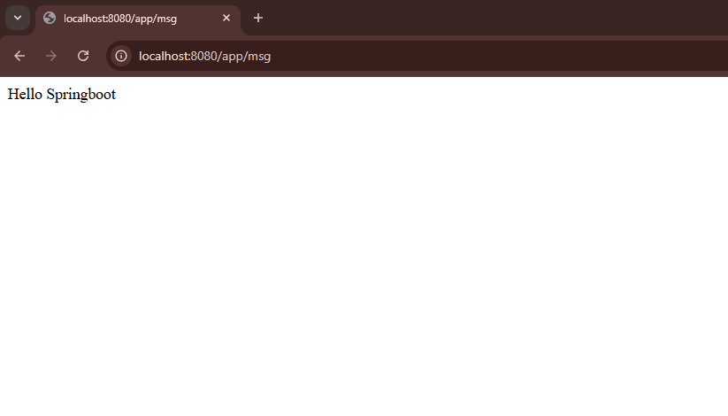
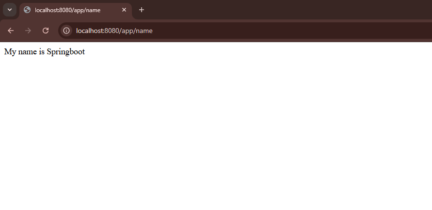
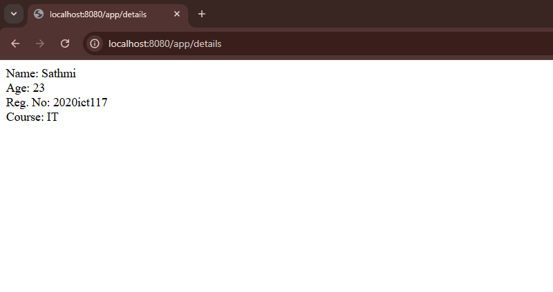

# IT3232 E-Commerce Practicals - Day 2 - 2025-03-21

## Project Overview
This project demonstrates a simple Spring Boot web service application created on March 21, 2025. The application provides basic REST API endpoints that return text responses.

## Project Structure
- `AppController.java` - Contains basic greeting endpoints
- `StudentDetailsController.java` - Contains student information endpoint
- `Output1.png`, `Output2.png`, `Output3.png` - Screenshots showing endpoint responses

## Endpoints

### AppController
The AppController handles basic greeting messages:

1. **GET /app/msg**
   - Returns a simple greeting message: "Hello Springboot"
   - URL: `http://localhost:8080/app/msg`

    ### Output
     

2. **GET /app/name**
   - Returns an introduction: "My name is Springboot"
   - URL: `http://localhost:8080/app/name`

    ### Output
     

### StudentDetailsController
The StudentDetailsController provides student information:

1. **GET /app/details**
   - Returns formatted student details including name, age, registration number, and course
   - URL: `http://localhost:8080/app/details`
   - Response format:
     ```
     Name: Sathmi
     Age: 23
     Reg. No: 2020ict117
     Course: IT
     ```
    ### Output
     

## Technologies Used
- Spring Boot
- Spring Web
- Java