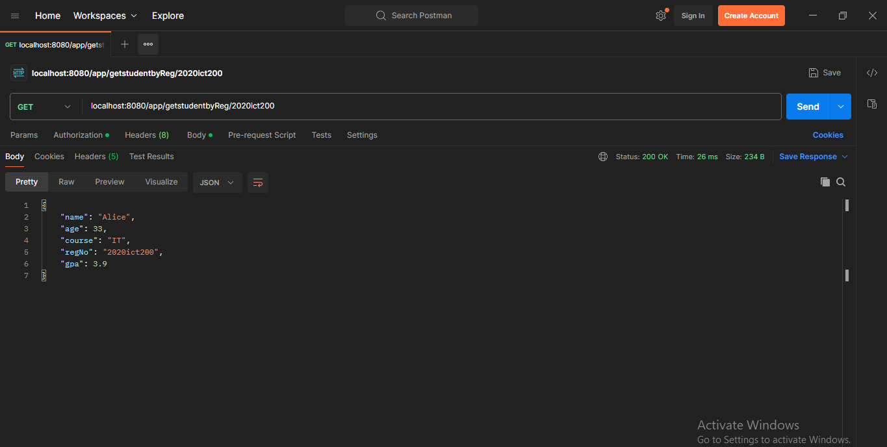

# IT3232 E-Commerce Practicals - Day 3 - 2025-03-28

## Project Overview
This Spring Boot web service application demonstrates basic REST API endpoints for sending data and managing student information.

## Project Structure
- `controller/`
  - `SendDataController.java`: Handles basic data sending endpoints
  - `StudentController.java`: Manages student-related operations
- `model/`
  - `Student.java`: Student data model class

## Endpoints

### SendDataController Endpoints
1. **GET /app/age/{ag}**
   - Returns age as a string
   - Example: `/app/age/25` 
   - Response: `"My age is 25"`

    ### Output
     

2. **GET /app/information/{ag},{nm}**
   - Returns name and age
   - Example: `/app/information/25,John`
   - Response: 
     ```
     My name is John
     My age is 25
     ```

    ### Output
     

### StudentController Endpoints
1. **GET /app/studetails**
   - Returns details of the first student (Bob)
   - URL: `http://localhost:8080/app/studetails`

    ### Output
     

2. **GET /app/allstudetails**
   - Returns a list of all predefined students
   - URL: `http://localhost:8080/app/allstudetails`

    ### Output
     

3. **GET /app/getstudentbyReg/{reg}**
   - Retrieves a student by registration number
   - Example: `/app/getstudentbyReg/2020ict150`
   - Returns student details or null if not found

    ### Output
     

4. **GET /app/studentbetween20and30**
   - Returns a list of students whose age is between 20 and 30
   - URL: `http://localhost:8080/app/studentbetween20and30`
   - Filters the student list based on age criteria

    ### Output
    

5. **GET /app/sortbyGPA**
   - Returns the list of students sorted by their GPA in ascending order
   - URL: `http://localhost:8080/app/sortbyGPA`
   - Uses Java Comparator to sort students by GPA

    ### Output
    

### CRUD Operations for Students

1. **CREATE - GET /app/addStudent/{nm},{ag},{crs},{reg},{gp}**
   - Adds a new student to the list
   - Example: `/app/addStudent/David,24,IT,2020ict300,3.7`
   - Parameters:
     - nm: Name
     - ag: Age
     - crs: Course
     - reg: Registration Number
     - gp: GPA
   - Returns the updated list of students

    ### Output
    

2. **UPDATE - GET /app/updateStudent/{reg},{nm},{ag},{crs},{gp}**
   - Updates an existing student identified by registration number
   - Example: `/app/updateStudent/2020ict150,Bob,24,IT,3.5`
   - Parameters:
     - reg: Registration Number (used to identify the student)
     - nm: Name (optional, leave empty string to skip)
     - ag: Age (optional, use 0 to skip)
     - crs: Course (optional, leave empty string to skip)
     - gp: GPA (optional, use negative value to skip)
   - Returns the updated student object or null if not found
    ### Output
    

3. **DELETE - GET /app/deleteStudent/{reg}**
   - Removes a student from the list based on registration number
   - Example: `/app/deleteStudent/2020ict150`
   - Parameter:
     - reg: Registration Number
   - Returns the updated list of students after deletion

    ### Output
    

## Predefined Students
- Bob: 23 years old, IT course, Reg No: 2020ict150, GPA: 3.3
- Alice: 33 years old, IT course, Reg No: 2020ict200, GPA: 3.9
- John: 25 years old, IT course, Reg No: 2020ict250, GPA: 2.5

## Technologies Used
- Spring Boot
- Spring Web
- Java