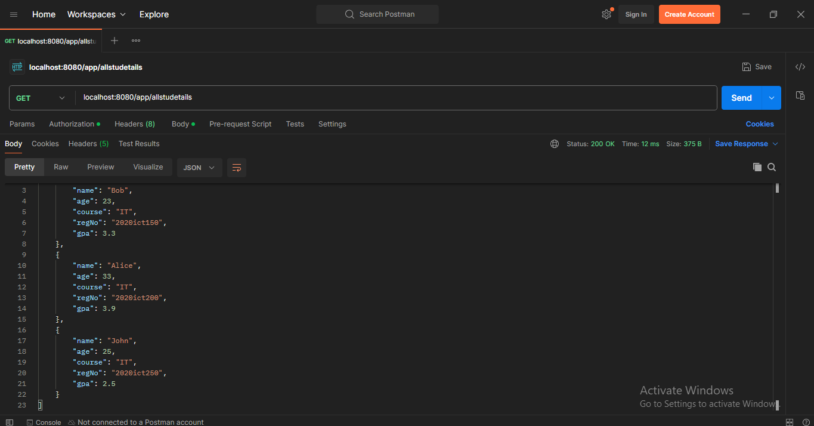

# IT3232 E-Commerce Practicals - Day 1 - 2025-03-28

## Project Overview
This Spring Boot web service application demonstrates basic REST API endpoints for sending data and managing student information.

## Project Structure
- `controller/`
  - `SendDataController.java`: Handles basic data sending endpoints
  - `StudentController.java`: Manages student-related operations
- `model/`
  - `Student.java`: Student data model class

## Endpoints

### SendDataController Endpoints
1. **GET /app/age/{ag}**
   - Returns age as a string
   - Example: `/app/age/25` 
   - Response: `"My age is 25"`

    ### Output
     

2. **GET /app/information/{ag},{nm}**
   - Returns name and age
   - Example: `/app/information/25,John`
   - Response: 
     ```
     My name is John
     My age is 25
     ```

    ### Output
     

### StudentController Endpoints
1. **GET /app/studetails**
   - Returns details of the first student (Bob)
   - URL: `http://localhost:8080/app/studetails`

    ### Output
     

2. **GET /app/allstudetails**
   - Returns a list of all predefined students
   - URL: `http://localhost:8080/app/allstudetails`

    ### Output
     

3. **GET /app/getstudentbyReg/{reg}**
   - Retrieves a student by registration number
   - Example: `/app/getstudentbyReg/2020ict150`
   - Returns student details or null if not found

    ### Output
     

## Predefined Students
- Bob: 23 years old, IT course, Reg No: 2020ict150, GPA: 3.3
- Alice: 22 years old, IT course, Reg No: 2020ict200, GPA: 3.9
- John: 25 years old, IT course, Reg No: 2020ict250, GPA: 2.5

## Technologies Used
- Spring Boot
- Spring Web
- Java