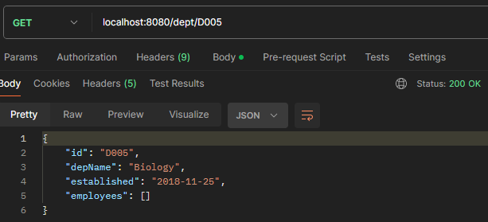
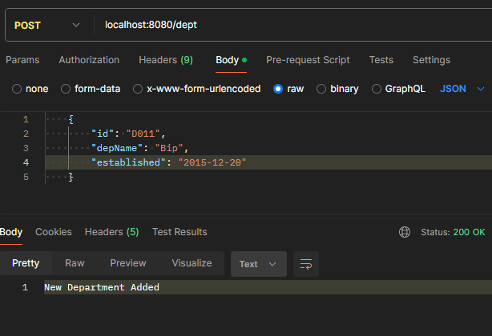
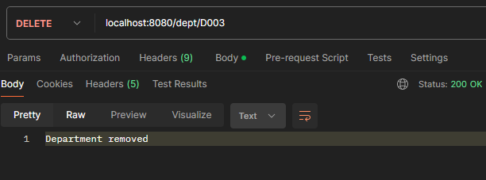
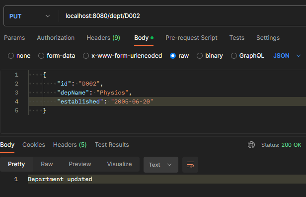

# IT3232 E-Commerce Practicals - Day 8 - 2025-05-16

## Get methods

### Get All Departments

Route : GET /dept/

**Output:**

``` JSON
[
    {
        "id": "D001",
        "depName": "Computer Science",
        "established": "2010-03-01",
        "employees": []
    },
    {
        "id": "D002",
        "depName": "Mathematics",
        "established": "2005-06-15",
        "employees": []
    },
    {
        "id": "D003",
        "depName": "Physics",
        "established": "2000-01-10",
        "employees": []
    },
    {
        "id": "D004",
        "depName": "Chemistry",
        "established": "2012-09-20",
        "employees": []
    },
    {
        "id": "D005",
        "depName": "Biology",
        "established": "2018-11-25",
        "employees": []
    }
]
```
### Get Department by Id

Route : GET /dept/D001

**Output:**

``` JSON

{
    "id": "D001",
    "depName": "Computer Science",
    "established": "2010-03-01",
    "employees": []
}

```

 

### Add Department

Route : POST /dept

``` JSON
{
    "id": "D010",
    "depName": "Applied Science",
    "established": "2010-03-01"
}
```
**Output:**

``` JSON
New Department Added

```

 

### Delete Department

Route : DELETE /dept/D001

**Output:**

``` JSON
Department removed

```

 

### Update Department

Route : PUT /dept/D001

**Output:**

``` JSON
Department updated

```

 