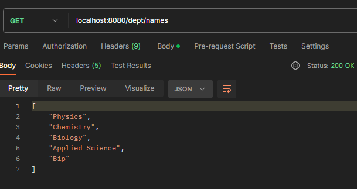
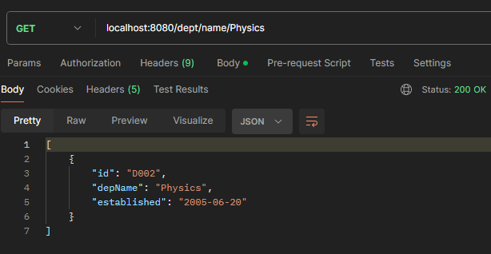
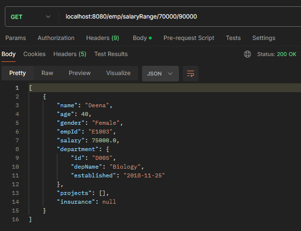
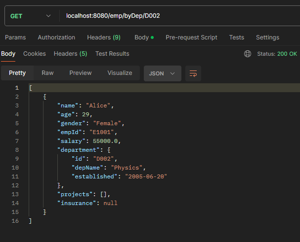
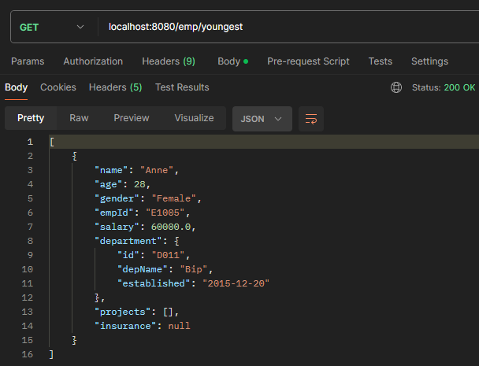

# IT3232 E-Commerce Practicals - Day 11 - 2025-05-30

## 1. JPQL (Java Persistence Query Language)

JPQL is a platform-independent query language that allows you to write queries against JPA entities. Unlike SQL which operates on database tables, JPQL operates on entity objects and their relationships.

### Key Features:
- **Object-Oriented**: Queries are written against entity classes, not database tables
- **Database Independent**: Same JPQL query works across different database systems
- **Type Safe**: Compile-time checking of entity names and properties
- **Relationship Navigation**: Easy navigation through entity relationships using dot notation

## 2. Custom JPQL Queries Implementation

### DepartmentRepo Custom Queries

#### Get Department Names Only
```java
@Query("Select depName from Department")
public List<String> getDeptNames();
```
- **Purpose**: Retrieves only the department names instead of full Department objects
- **Efficiency**: Reduces data transfer by selecting specific fields
- **Return Type**: `List<String>` containing department names

#### Search Departments by Name (Pattern Matching)
```java
@Query("SELECT d FROM Department d WHERE d.depName LIKE %?1%")
public List<Department> getDeptByName(String name);
```
- **Purpose**: Finds departments with names containing the search term
- **LIKE Operator**: Uses `%` wildcards for partial matching
- **Parameter Binding**: `?1` represents the first method parameter

### EmployeeRepo Custom Queries

#### Salary Range Search
```java
@Query("SELECT e FROM Employee e WHERE e.salary between %?1% AND %?2%")
public List<Employee> searchEmpbySalRange(int a, int b);
```
- **Purpose**: Finds employees within a specified salary range
- **BETWEEN Operator**: Inclusive range query
- **Multiple Parameters**: `?1` and `?2` for minimum and maximum values

#### Employees by Department
```java
@Query("SELECT e FROM Employee e WHERE e.department.id = %?1%")
public List<Employee> searchByDep(String depId);
```
- **Purpose**: Retrieves all employees working in a specific department
- **Relationship Navigation**: Uses `e.department.id` to access related entity
- **Foreign Key Query**: Queries based on department relationship

#### Youngest Employee Query
```java
@Query("SELECT e FROM Employee e WHERE e.age = (SELECT MIN(e.age) FROM Employee e)")
public List<Employee> youngestEmp();
```
- **Purpose**: Finds the youngest employee(s) in the company
- **Subquery**: Uses nested SELECT to find minimum age
- **Aggregate Function**: `MIN()` function to find minimum age value

## 3. @JsonIgnore Annotation

The `@JsonIgnore` annotation prevents infinite recursion in JSON serialization when dealing with bidirectional relationships.

### Implementation in Department Entity
```java
@JsonIgnore
@OneToMany(mappedBy="department")
private List<Employee> employees;
```

### Why @JsonIgnore is Necessary:
- **Bidirectional Relationship**: Department has employees, Employee has department
- **Infinite Loop Prevention**: Without @JsonIgnore, JSON serialization would loop infinitely
- **Performance Optimization**: Avoids loading unnecessary related data
- **Clean API Response**: Provides focused data without circular references

### Relationship Mapping:
- **Department → Employee**: One-to-Many relationship
- **Employee → Department**: Many-to-One relationship (managed by Employee.department field)
- **mappedBy="department"**: Indicates that Employee entity owns the relationship

## 4. Service Layer Enhancements

### Department Service Custom Methods

#### Get Department Names
```java
public List<String> getDepartmentNames() {
    if(repo.getDeptNames().isEmpty()) {
        throw new EntityNotFoundException("Department Not Found");
    }
    return repo.getDeptNames();
}
```

#### Search Department by Name
```java
public List<Department> searchName(String name) {
    if(repo.getDeptByName(name).isEmpty()) {
        throw new EntityNotFoundException("Department Not Found");
    }
    return repo.getDeptByName(name);
}
```

### Employee Service Custom Methods

#### Salary Range Search
```java
public List<Employee> searchBySalary(int min, int max) {
    if(repo.searchEmpbySalRange(min,max).isEmpty()) {
        throw new EntityNotFoundException("Employee Not Found");
    }
    return repo.searchEmpbySalRange(min,max);
}
```

#### Find Employees by Department
```java
public List<Employee> searchEmpsByDep(String depId) {
    if(repo.searchByDep(depId).isEmpty()) {
        throw new EntityNotFoundException("Employee Not Found");
    }
    return repo.searchByDep(depId);
}
```

#### Find Youngest Employees
```java
public List<Employee> findYoungest(){
    if(repo.youngestEmp().isEmpty()) {
        throw new EntityNotFoundException("Employee Not Found");
    }
    return repo.youngestEmp();
}
```

## 5. Controller Endpoints

### Department Controller New Endpoints

#### Get Department Names Only
- **Endpoint**: `GET /dept/names`
- **Purpose**: Retrieve list of department names for dropdowns/selection
- **Response**: `List<String>` of department names
#### Output


#### Search Departments by Name
- **Endpoint**: `GET /dept/name/{name}`
- **Purpose**: Find departments with names containing the search term
- **Response**: `List<Department>` matching the search criteria
#### Output


### Employee Controller New Endpoints

#### Salary Range Search
- **Endpoint**: `GET /emp/salaryRange/{min}/{max}`
- **Purpose**: Find employees within salary range
- **Parameters**: min and max salary values
- **Response**: `List<Employee>` within the salary range
#### Output


#### Employees by Department
- **Endpoint**: `GET /emp/byDep/{depId}`
- **Purpose**: Get all employees in a specific department
- **Parameter**: Department ID
- **Response**: `List<Employee>` in the department
#### Output


#### Youngest Employees
- **Endpoint**: `GET /emp/youngest`
- **Purpose**: Find the youngest employee(s)
- **Response**: `List<Employee>` with minimum age
#### Output


## 6. Key Learning Outcomes

### JPQL Benefits:
- **Database Independence**: Write once, run on any database
- **Object-Oriented Approach**: Work with entities, not tables
- **Relationship Navigation**: Easy access to related entity properties
- **Type Safety**: Compile-time validation of queries
- **Integration**: Seamless integration with Spring Data JPA

### @JsonIgnore Best Practices:
- **Use on Collection Side**: Apply to the "many" side of One-to-Many relationships
- **Prevent Circular References**: Essential for bidirectional relationships
- **Performance Consideration**: Avoid loading unnecessary data
- **API Design**: Keep JSON responses clean and focused

### Custom Query Implementation:
- **Repository Layer**: Define queries in repository interfaces
- **Service Layer**: Add business logic and exception handling
- **Controller Layer**: Expose endpoints with proper HTTP status codes
- **Error Handling**: Consistent exception handling across all endpoints

## 7. Advanced JPQL Features Demonstrated

### Parameter Binding:
- **Positional Parameters**: `?1`, `?2` for method parameters
- **Type Safety**: Automatic type conversion for parameters

### Aggregate Functions:
- **MIN()**: Find minimum values in datasets
- **Subqueries**: Nested SELECT statements for complex queries

### Pattern Matching:
- **LIKE Operator**: Flexible string matching with wildcards
- **Case Sensitivity**: Default case-sensitive matching

### Range Queries:
- **BETWEEN Operator**: Inclusive range filtering
- **Numeric Comparisons**: Efficient range-based searches
